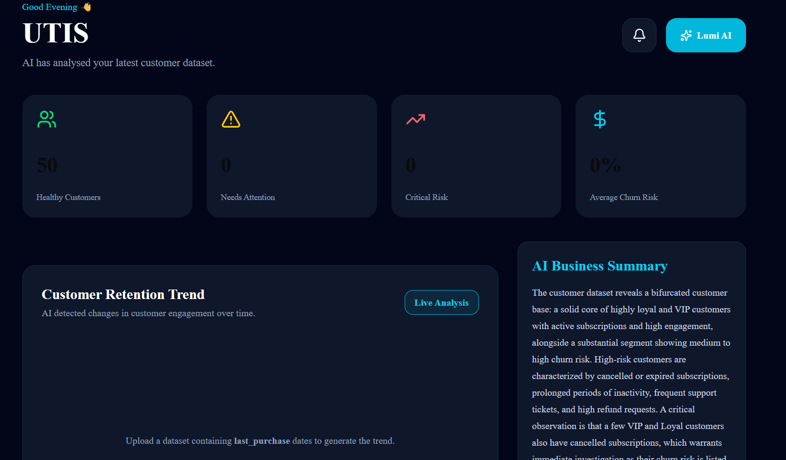
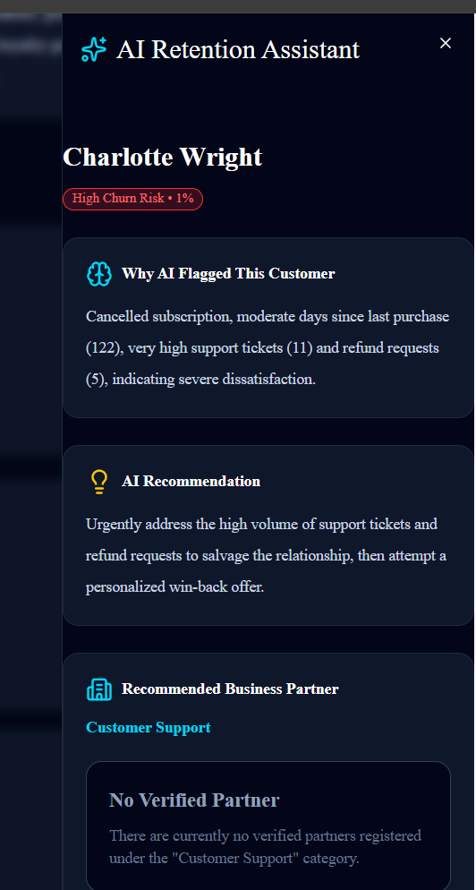

# 🤖 AI Customer Retention Platform

An AI-powered customer retention platform that helps businesses identify customers at risk of churning and connects them with verified solution partners to improve customer retention.

Built during the **TalentLabs Hackathon 2026**.

---

# 📖 Overview

Customer retention is often more cost-effective than acquiring new customers, yet many SMEs struggle to identify which customers are likely to leave.

This platform leverages **Google Gemini 3.6 Flash** to analyze customer datasets, predict customer churn risk, explain why customers may churn, recommend actionable retention strategies, and connect businesses with verified solution providers.

---

# 🎯 Problem Statement

Many businesses:

* Lack insights into customer churn.
* Store customer data without extracting meaningful insights.
* Struggle to determine effective retention strategies.
* Have difficulty finding trusted service providers to improve customer engagement.

Without actionable insights, businesses risk losing customers and revenue.

---

# ✨ Features

## 🧠 AI Customer Churn Analysis

* Upload customer datasets in CSV format.
* AI analyzes customer behaviour.
* Predicts customer churn risk.
* Explains why customers are likely to churn.
* Generates actionable retention recommendations.
* Recommends suitable solution partner categories.

---

## 📊 Interactive Dashboard

* Customer churn overview
* Revenue insights
* Customer engagement analytics
* Churn statistics
* AI-generated business summary

---

## 🤝 Solution Partner Marketplace

Verified businesses can register as solution partners.

Supported categories include:

* Marketing
* Customer Support
* CRM
* Loyalty Program
* Email Marketing
* Analytics
* Automation
* Social Media
* Customer Feedback
* Consulting

Businesses receive partner recommendations based on AI analysis results.

---

## 🔐 Authentication

* Secure email/password authentication
* Email verification
* Business accounts
* Solution Partner accounts
* Separate dashboards for businesses and partners

---

## ☁ Cloud Database

Built using **Supabase** for:

* Authentication
* PostgreSQL Database
* Secure data storage

---

# 🛠 Tech Stack

## Frontend

* Next.js 16
* React 19
* TypeScript
* Tailwind CSS

## Backend

* Next.js Route Handlers (API Routes)

## Database

* Supabase

  * Authentication
  * PostgreSQL Database

## AI

* Google Gemini 3.6 Flash API

## Deployment

* Vercel

---

# 🏗️ System Architecture

```text
Business User
      │
      ▼
Upload CSV Dataset
      │
      ▼
Next.js API Route
      │
      ▼
Google Gemini AI
      │
      ▼
Customer Churn Analysis
      │
      ▼
Supabase Database
      │
      ▼
Business Dashboard
      │
      ▼
Recommended Solution Partners
```

---

# 📂 Project Structure

```text
app/
├── api/
│   └── analyze/
├── dashboard/
├── login/
├── partner/
├── register/
├── upload/

components/
lib/
public/
screenshots/
```

---

# 🚀 Installation

### Clone the repository

```bash
git clone https://github.com/Yan0521-dot/ai-customer-retention-platform.git
```

### Navigate into the project

```bash
cd ai-customer-retention-platform
```

### Install dependencies

```bash
npm install
```

### Create a `.env.local` file

```env
NEXT_PUBLIC_SUPABASE_URL=your_supabase_url
NEXT_PUBLIC_SUPABASE_PUBLISHABLE_KEY=your_supabase_publishable_key
GEMINI_API_KEY=your_gemini_api_key
```

### Start the development server

```bash
npm run dev
```

### Open your browser

```text
http://localhost:3000
```

---

# 📷 Screenshots

## Landing Page


---

## Dashboard



---

## AI Analysis


---

## Partner Dashboard



---

# 👥 Team Members

* **Aathityan**
* **Amira**
* **Hamesh**
* **Omar**

---

# 🔮 Future Improvements

* Real-time churn prediction
* Fine-tuned machine learning models
* CRM integrations
* Email marketing automation
* WhatsApp customer engagement
* Subscription payment integration
* Multi-language support
* Advanced analytics dashboard
* Real-time notifications

---

# 🌍 Target Users

* Small and Medium Enterprises (SMEs)
* Restaurants
* Cafés
* Retail Businesses
* E-commerce Stores
* Service Providers
* Marketing Agencies

---

# 💡 Why Our Solution?

Unlike traditional dashboards that only visualize customer data, our platform:

* Uses AI to predict customer churn.
* Explains why customers may churn.
* Provides actionable retention recommendations.
* Connects businesses with verified solution partners.
* Combines AI-powered analytics and business networking in one platform.

---

# 📄 License

This project was developed for the **TalentLabs Hackathon 2026** for educational and demonstration purposes.
